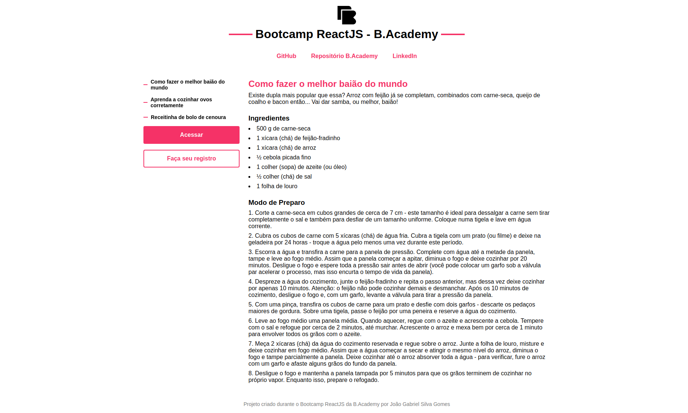
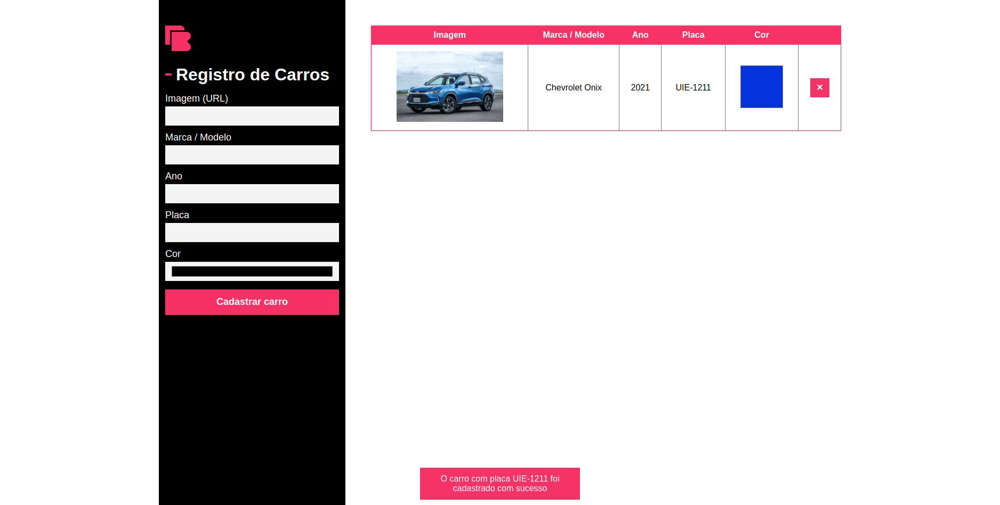

<div align="center">
  
  <h1>Desafios Bootcamp ReactJS - B.Academy</h1>
</div>

This repository stores the codes of B.Academy's ReactJS Bootcamp challenges, with two projects developed so far:

1. Website as a blog
2. Car registration system

<p align="center">
  
  
</p>

# 🎮 Getting started

<h3 style="font-size: 18px;">🧬 Clone this repository</h3>

```bash
git clone https://github.com/joaogabriel-sg/b-academy-bootcamp-challenges.git
```

<h3 style="font-size: 18px;">📂 Move yourself to the appropriate directory</h3>

```bash
cd b-academy-bootcamp-challenges
```

<h3 style="font-size: 18px;">🎉 Install the package dependencies</h3>

```bash
npm install
# or
yarn
```

# 🔥 Usage

## Challenge 01

```bash
cd challenge-01
```

```bash
npm start
# or
yarn start
```

Open [http://localhost:3000](http://localhost:3000) to view it in the browser.

## Challenge 02

```bash
cd challenge-02
```

```bash
npm start
# or
yarn start
```

Open [http://localhost:3000](http://localhost:3000) to view it in the browser.

## Challenge 03

### Running server

```bash
cd server
```

```bash
npm run dev
# or
yarn dev
```

### Running project

```bash
cd challenge-03
```

```bash
npm start
# or
yarn start
```

Open [http://localhost:3000](http://localhost:3000) to view it in the browser.

## Challenge 04

### Running server

```bash
cd server
```

```bash
npm run dev
# or
yarn dev
```

### Running project

```bash
cd challenge-04
```

```bash
# website as a blog
cd bootcamp-project
# or car registration system
cd car-registration
```

```bash
npm start
# or
yarn start
```

Open [http://localhost:3000](http://localhost:3000) to view it in the browser.

# 🚀 Techs

- React
- React Hooks
- Styled Components
- Fetch API

# 👨🏻‍💻 Author

- GitHub: [joaogabriel-sg](https://github.com/joaogabriel-sg)
- LinkedIn: [joaogabriel-sg](https://www.linkedin.com/in/joaogabriel-sg/)

# ✨ Show your support

Give a ⭐ if this project helped you or if you liked it!
